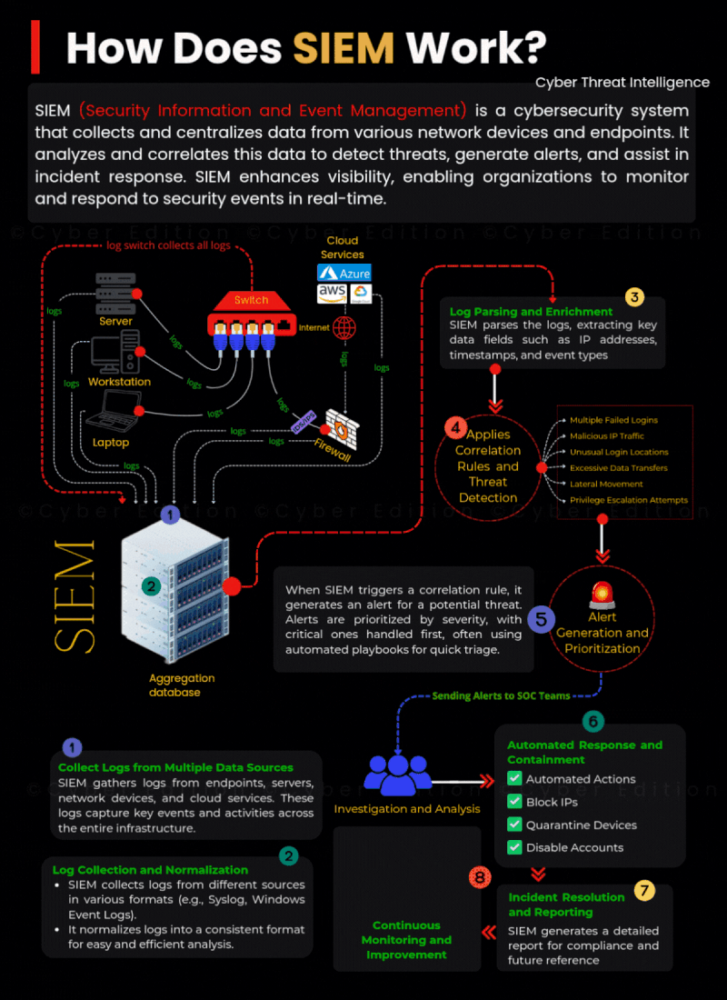
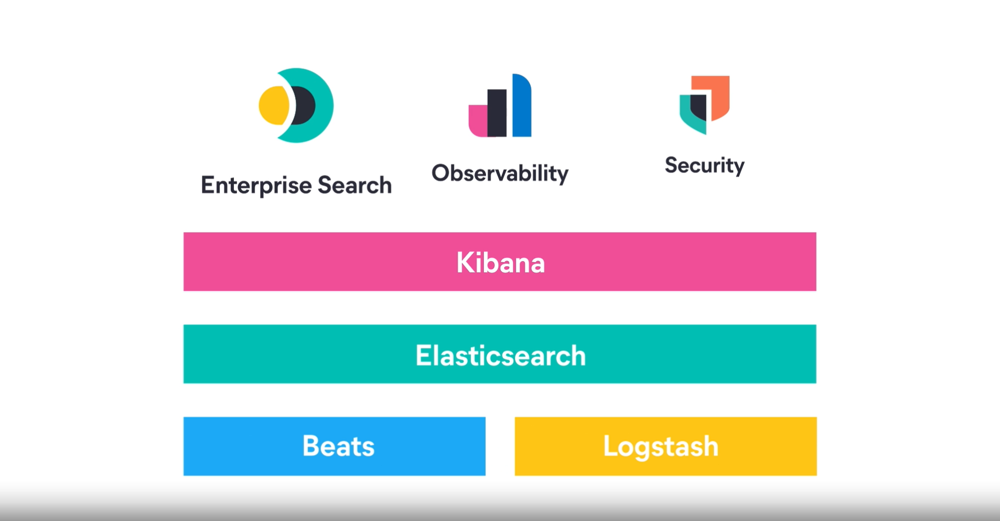
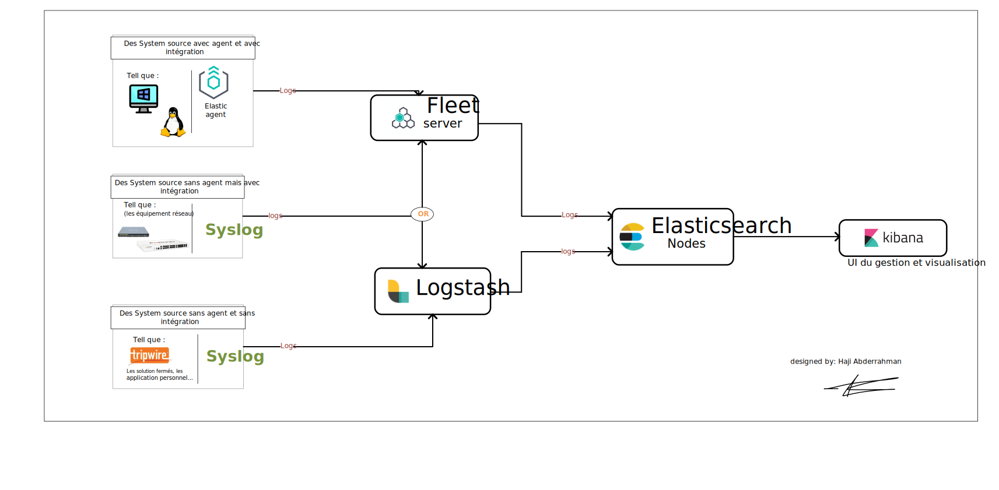

# Readme

# 📘 **The Complete Elastic Stack SIEM Guide**

### **From Zero to Threat Hunter**

**Author:** Haji Aderrahman

**Project Status:** 🚧 Active Development

## 👋 **Introduction & How to Use This Repository**

Welcome to the **Elastic Stack SIEM Complete Guide**. This project is designed to be more than just a tutorial—it is a comprehensive journey into the world of Security Operations.

### **How to navigate this repository:**

To get the most out of this guide, I recommend following the modules in order:

1. **Module 1:** Master the fundamentals of SIEM (Security Information and Event Management).
2. **Module 2:** Understand the market landscape and why we chose the Elastic Stack.
3. **Module 3:** Deep dive into the Elastic Stack architecture (ELK) and modern ingestion strategies.
4. **Module 4:** **Hands-On Labs** – Step-by-step deployment guides for various architectures.

> 💡 Tip: This repository is designed to complement the [Official Elastic Documentation](https://www.elastic.co/docs). Use this guide for practical, real-world context and the official docs for API references or for get more deep on each informatioin.
> 

> 🚧⚠️ Note : this is a work of days and night, so it’s will be a nice step from you to support me however you want repost it sugges my profil on opporurnitys or taking a caffe for me.
>
 
> 
> ## 📋 **Quick Navigation**
>
> * [**Introduction & Guide**](#-introduction--how-to-use-this-repository)
> * [**Module 1: What is a SIEM ? 🛡️**](#module-1-what-is-a-siem--️)
>     * [Workflow & Architecture](#4-siem-workflow-the-journey-of-a-log-)
> * [**Module 2: Why ELK? 🚀**](#module-2--why-elk--)
> * [**Module 3: What is Elastic Stack**](#module-3--what-is-elastic-stack)
>     * [Agents & Fleet](#4-modern-data-ingestion-elastic-agent--fleet-)
> * [**Module 4: Hands-On Labs**](#module-4--hands-on-lab)
> 

📚 <b>Table of Contents (Click to Expand)</b>

 

- [Readme](#readme)
- [📘 **The Complete Elastic Stack SIEM Guide**](#-the-complete-elastic-stack-siem-guide)
    - [**From Zero to Threat Hunter**](#from-zero-to-threat-hunter)
  - [👋 **Introduction \& How to Use This Repository**](#-introduction--how-to-use-this-repository)
    - [**How to navigate this repository:**](#how-to-navigate-this-repository)
  - [Demo](#demo)
- [**Module 1: What is a SIEM ? 🛡️**](#module-1-what-is-a-siem--️)
    - [**1. The Story of SIEM**](#1-the-story-of-siem)
    - [**2. Definition: What exactly is a SIEM? 🧐**](#2-definition-what-exactly-is-a-siem-)
    - [**Beyond Simple Logging**](#beyond-simple-logging)
    - [**The "SIEM Formula"**](#the-siem-formula)
    - [**3. Types of Data: Logs, Metrics, and Events 📊**](#3-types-of-data-logs-metrics-and-events-)
    - [**A. Logs (The "What Happened" Record) 📝**](#a-logs-the-what-happened-record-)
    - [**B. Metrics (The "How is it Running" Measurement) 📈**](#b-metrics-the-how-is-it-running-measurement-)
    - [**C. Events (The "Important Occurrence") 🔔**](#c-events-the-important-occurrence-)
  - [**4. SIEM Workflow: The Journey of a Log** 🔄](#4-siem-workflow-the-journey-of-a-log-)
    - [**Stage 1: Multi-Source Collection** 📥](#stage-1-multi-source-collection-)
    - [**Stage 2: Aggregation and Normalization** 🧩](#stage-2-aggregation-and-normalization-)
    - [**Stage 3: Log Parsing and Enrichment** 🔍](#stage-3-log-parsing-and-enrichment-)
    - [**Stage 4: Correlation and Threat Detection** 🧠](#stage-4-correlation-and-threat-detection-)
    - [**Stage 5: Alert Generation and Prioritization** 🚨](#stage-5-alert-generation-and-prioritization-)
    - [**Stage 6: Automated Response and Containment (SOAR)** 🤖](#stage-6-automated-response-and-containment-soar-)
    - [**Stage 7: Incident Resolution and Reporting** 📑](#stage-7-incident-resolution-and-reporting-)
    - [**Stage 8: Continuous Monitoring and Improvement** 🔄](#stage-8-continuous-monitoring-and-improvement-)
  - [**5. SIEM Architecture: The Engine Under the Hood** 🏗️](#5-siem-architecture-the-engine-under-the-hood-️)
    - [**Layer 1: Information Gathering \& Ingestion (The "Sensors")** 📥](#layer-1-information-gathering--ingestion-the-sensors-)
    - [**Layer 2: Data to Information Layer (The "Brain")** 🧠](#layer-2-data-to-information-layer-the-brain-)
    - [**Layer 3: Presentation \& SOC Interface (The "Cockpit")** 🖥️](#layer-3-presentation--soc-interface-the-cockpit-️)
- [Module 2 : Why ELK ? 🚀](#module-2--why-elk--)
    - [**1. SIEM Benchmarking: The Industry Leaders** 📊](#1-siem-benchmarking-the-industry-leaders-)
    - [**The Market Vision**](#the-market-vision)
    - [**2. Why Choose ELK? (The Conclusion)** 🎯](#2-why-choose-elk-the-conclusion-)
    - [**A. "Start Free, Scale Big" (Cost Efficiency) 💰**](#a-start-free-scale-big-cost-efficiency-)
    - [**B. Unmatched Speed \& Search Performance ⚡**](#b-unmatched-speed--search-performance-)
    - [**C. Unified Observability \& Security 🔄**](#c-unified-observability--security-)
    - [**D. Community-Driven \& Transparent 🤝**](#d-community-driven--transparent-)
- [Module 3 : What is Elastic Stack](#module-3--what-is-elastic-stack)
    - [**1. The Story: "You Know, for Search."** 🕰️](#1-the-story-you-know-for-search-️)
    - [**2. The Core Components (The "Engine")** ⚙️](#2-the-core-components-the-engine-️)
    - [**4. Modern Data Ingestion: Elastic Agent \& Fleet** ⚓](#4-modern-data-ingestion-elastic-agent--fleet-)
    - [**A. The Elastic Agent (The Unified Soldier) 🛡️**](#a-the-elastic-agent-the-unified-soldier-️)
    - [**B. Fleet Server (The Command Center) 🏰**](#b-fleet-server-the-command-center-)
    - [**5. Data Ingestion Strategies: How We Handle Different Sources** 🧬](#5-data-ingestion-strategies-how-we-handle-different-sources-)
    - [**A. Systems Supporting Elastic Agents (The Direct Method) 💻**](#a-systems-supporting-elastic-agents-the-direct-method-)
    - [**B. Systems with Pre-built Integrations (The Syslog/IP Trick) 🌐**](#b-systems-with-pre-built-integrations-the-syslogip-trick-)
    - [**C. Legacy \& Closed Solutions (The Logstash Power-User Method) 🛠️**](#c-legacy--closed-solutions-the-logstash-power-user-method-️)
- [Module 4 : Hands on lab](#module-4--hands-on-lab)

## Demo

but first befor going on the thearical detialed thachnical explaniation of the  SIEM let’s see dimo of what we are going to build 

---

# **Module 1: What is a SIEM ? 🛡️**

Dive into the world of **Security Information and Event Management (SIEM)** like a cyber detective in a high-stakes thriller! 🕵️‍♂️

### **1. The Story of SIEM**

SIEM did not appear overnight; it evolved from the convergence of two distinct security domains:

- **SIM (Security Information Management):** Focuses on long-term storage, log collection, and compliance reporting. Think of it as the **"Library"** 📚 of your infrastructure.
- **SEM (Security Event Management):** Focuses on real-time monitoring, incident correlation, and immediate response. Think of it as the **"Alarm System." 🚨.**

In **2005**, Gartner analysts **Mark Nicolett** and **Amrit Williams** coined the term "SIEM." By merging these two concepts, they created the superhero of cybersecurity: a unified platform that collects, analyzes, and responds to threats across your entire network. It's like having a 24/7 digital watchdog 🐕 that barks at the slightest anomaly!

---

### **2. Definition: What exactly is a SIEM? 🧐**

At its core, **SIEM (Security Information and Event Management)** is a centralized security solution that provides a **"single pane of glass"** for an organization's security posture.

Instead of checking dozens of different security tools, a SIEM aggregates everything into one interface. It works by **collecting, normalizing, and analyzing** data from across the entire infrastructure—including servers, firewalls, endpoints, and cloud services.

### **Beyond Simple Logging**

A SIEM does more than just store logs; it acts as the "brain" of the SOC (Security Operations Center). It uses **Correlation Rules** and **Anomaly Detection** to identify threats that would remain invisible if you looked at each system individually.

### **The "SIEM Formula"**

The true power of a SIEM lies in this simple equation:

> SIM (Long-term storage & Compliance) + SEM (Real-time monitoring & Alerting) = SIEM
> 

By centralizing this "huge data" into a single platform, the SIEM allows security teams to detect, investigate, and respond to incidents faster than ever before.

---

### **3. Types of Data: Logs, Metrics, and Events 📊**

In the world of the **Elastic Stack** and **SIEM**, we deal with three primary types of telemetry. Understanding the difference between them is crucial for effective **Detection Engineering**.
Think of these as the "fuel" that powers your security monitoring.

### **A. Logs (The "What Happened" Record) 📝**

A log is a timestamped record (text or structured JSON) generated by a system or application. It provides the raw, detailed history of every action taken.

- **Characteristics:** High granularity, can be structured (ECS) or unstructured.
- **Security Use Case:** **Forensic Investigation.** If a breach occurs, logs tell you exactly which command was executed or which sensitive file was modified.
- **Example:** `2025-10-21 14:02:01 - User 'admin' changed password for 'guest_user' from IP 192.168.1.50`

### **B. Metrics (The "How is it Running" Measurement) 📈**

Metrics are numerical measurements of a system's state over time. They are lightweight, efficient, and highly predictable.

- **Characteristics:** Quantitative (numbers, percentages, gauges).
- **Security Use Case:** **Anomaly Detection.** Identifying a **DDoS attack** (sudden spike in network traffic) or **Cryptomining** (unexplained 100% CPU usage).
- **Example:** `CPU Usage: 98%`, `Network Out: 500MB/s`, `Disk Space: 10% remaining`.

### **C. Events (The "Important Occurrence") 🔔**

An event is a specific, discrete action that occurred on a system. While every event is recorded as a log, **not every log is a significant security event.** In a SIEM context, an event is a "Log with actionable meaning."

- **Characteristics:** Action-oriented and often triggers a correlation rule.
- **Security Use Case:** **Real-time Alerting.** Identifying critical milestones in an attack kill chain.
- **Example:** `Successful Login`, `Firewall Connection Blocked`, `New Process Started`.
    
    ---
    

- **Summary**

| **Data Type** | **Primary Question** | **Format** | **Data Size** | **Best for...** |
| --- | --- | --- | --- | --- |
| **Logs** | "Who did what?" | Text / JSON | Heavy | Forensics & Troubleshooting |
| **Metrics** | "Is the system okay?" | Numbers | Light | Anomaly Detection & Baselining |
| **Events** | "What just happened?" | Structured | Medium | Real-time Alerting |

---

## **4. SIEM Workflow: The Journey of a Log** 🔄

To understand how a SIEM transforms millions of raw data points into a single critical alert, we can break down its operation into **8 key stages**, based on the standard SOC (Security Operations Center) architecture:

### **Stage 1: Multi-Source Collection** 📥

The SIEM begins by gathering logs from every corner of the infrastructure:

- **Endpoints:** Workstations and servers (Windows, Linux).
- **Network:** Firewalls (FortiGate), Switches, and Routers.
- **Cloud Services:** Azure, AWS, Google Cloud.
- **Security Tools:** IDS/IPS, Antivirus, and EDRs.

### **Stage 2: Aggregation and Normalization** 🧩

Since every device speaks its own "language" (Syslog, JSON, XML, etc.), the SIEM centralizes all data into an aggregation database and converts it into a common format.

> 💡 In the Elastic Stack: This is where the Elastic Common Schema (ECS) comes in, ensuring that fields like Source_IP and src_ip are unified into a single searchable field.
> 

### **Stage 3: Log Parsing and Enrichment** 🔍

The SIEM "parses" the logs to extract essential fields (IP addresses, timestamps, user IDs). It also **enriches** the data—for example, by adding Geo-IP location or checking if an IP is flagged by **Threat Intelligence** feeds.

### **Stage 4: Correlation and Threat Detection** 🧠

This is the "Brain" of the system. The SIEM applies **Correlation Rules** to link isolated events together.

- *Example:* 10 Failed Logins (Event A) + 1 Successful Login (Event B) from an unusual IP = **Brute Force Alert**.

### **Stage 5: Alert Generation and Prioritization** 🚨

When a rule is triggered, an alert is generated. The SIEM assigns a **Severity Score** (Low, Medium, High, Critical) so analysts know which threats to investigate first.

### **Stage 6: Automated Response and Containment (SOAR)** 🤖

Modern SIEMs can trigger immediate "Playbooks" to contain threats without human intervention:

- Blocking a malicious IP on the Firewall.
- Quarantining an infected workstation.
- Disabling a compromised user account.

### **Stage 7: Incident Resolution and Reporting** 📑

Once the incident is handled, the SIEM generates detailed reports. This is vital for **Compliance** and for maintaining a legal audit trail of the attack and the response taken.

### **Stage 8: Continuous Monitoring and Improvement** 🔄

Finally, the workflow is a loop. Analysts use "Lessons Learned" from past incidents to fine-tune correlation rules and improve the overall security posture.

## **5. SIEM Architecture: The Engine Under the Hood** 🏗️

> *As shown in the architecture diagram above, a SIEM acts as a sophisticated funnel, taking raw, chaotic data from the bottom and refining it into clear, prioritized security actions at the top.*
> 

As shown in the architecture diagram above, a SIEM acts as a sophisticated funnel, taking raw, chaotic data from the bottom and refining it into clear, prioritized security actions at the top.

A SIEM is not just a single application; it is a complex, multi-layered ecosystem designed to handle massive data flows while providing real-time intelligence. By breaking down the architecture, we can identify the essential components that turn raw logs into actionable security insights.

### **Layer 1: Information Gathering & Ingestion (The "Sensors")** 📥

This is the foundation where data enters the system from the entire infrastructure.

- **Event Sources:** The SIEM pulls data from a vast array of sources, including **Network** devices, **IPS**, **Access Control**, **Applications**, **Honeypots**, and **Identity Management (IAM)**.
- **Data Collection Agents:** These are the frontline "sensors" (like **Elastic Agent** or **Beats**) that capture system events in real-time. Devices that cannot host agents, like your **FortiGate firewall**, send data via **Syslog**.
- **De-duplication & Normalization:** To save storage, **Protocol** and **Application Agents** remove duplicate logs and "translate" them into a uniform format (Normalization). In Elastic, this ensures all data follows the **Elastic Common Schema (ECS)**.

### **Layer 2: Data to Information Layer (The "Brain")** 🧠

Once data is normalized, it moves to the processing core where it is transformed into intelligence.

- **The Indexing Database (Event DB):** This is the heart of the SIEM where all normalized messages, statistics, and alerts are stored. Modern SIEMs like Elasticsearch allow for near-instant searching across terabytes of data.
- **Correlation Engine:** This component compares incoming logs against a **Knowledge Base** of vulnerabilities and security policies to find attack patterns.
- **Detection Engine:** It runs **Correlation Rules** (e.g., "5 failed logins + 1 success") to identify threats that would be invisible if looking at systems individually. It may also use **Machine Learning** to detect anomalies like unusual login times.

### **Layer 3: Presentation & SOC Interface (The "Cockpit")** 🖥️

This is the top layer where the Security Operations Center (SOC) analysts interact with the system.

- **Real-Time Dashboards:** Visual representations (Pie charts, maps, timelines) that provide a **"Single Pane of Glass"** view of the organization's security posture.
- **Alert Generation & Prioritization:** When a threat is detected, the SIEM generates an alert, prioritizing it by severity so analysts know what to investigate first.
- **Incident Response & SOAR:** The interface integrates with **Ticket Systems** and **Knowledge Bases** to help teams respond. Modern systems can use **Automated Playbooks** to block malicious IPs or quarantine devices instantly.

---

# Module 2 : Why ELK ? 🚀

This module explores the competitive landscape of SIEM solutions and explains why the Elastic Stack (ELK) is a game-changer for modern Security Operations.

### **1. SIEM Benchmarking: The Industry Leaders** 📊

When choosing a SIEM, organizations typically look at the **Gartner Magic Quadrant** for SIEM. As of 2025/2026, the market is led by a few heavyweights. Below is a comparison of the top contenders:

| **Feature** | **Splunk Enterprise Security** | **IBM QRadar** | **Elastic Security (ELK)** |
| --- | --- | --- | --- |
| **Model** | Proprietary / Closed Source | Proprietary / Appliance-based | **Open Ecosystem / Flexible** |
| **Pricing** | Ingest-based (Can be very expensive) | EPS (Events Per Second) based | **Resource-based (Pay for infra)** |
| **Scalability** | High, but costs scale with data | High, but requires complex tuning | **Near-Infinite (Horizontal scaling)** |
| **Deployment** | Cloud / On-Prem | Hybrid / Managed | **Anywhere (Cloud, Docker, Bare Metal)** |
| **Learning Curve** | Steep (Requires SPL knowledge) | High (Complex Administration) | **Moderate (Intuitive Kibana UI)** |
| **Best For** | Massive heterogeneous estates | Highly regulated industries | **Modern SOCs & Cost-conscious teams** |

### **The Market Vision**

- **Splunk** is the "Swiss Army Knife" but often comes with a "Splunk Tax"—it gets exponentially more expensive as your logs grow.
- **QRadar** is a powerful legacy beast, perfect for IBM-first environments, but it can feel rigid and "old school" in its interface.
- **ELK** disrupts this by offering a **Search-First** approach to security.

---

### **2. Why Choose ELK? (The Conclusion)** 🎯

After benchmarking, the decision to go with the Elastic Stack is based on four strategic pillars:

### **A. "Start Free, Scale Big" (Cost Efficiency) 💰**

Unlike traditional SIEMs that charge you per gigabyte of data you ingest, Elastic’s core is free. You are only limited by the hardware you provide. This allows a company to collect **all** logs (even low-priority ones) without breaking the budget.

### **B. Unmatched Speed & Search Performance ⚡**

Elasticsearch was born as a search engine. In a security crisis, every second counts. Finding a specific malicious IP among billions of rows is faster in Elastic than in almost any other platform.

### **C. Unified Observability & Security 🔄**

This is ELK's "Secret Sauce." It is the only platform where your **Logs, Metrics, and Traces** live in the same place.

- *Example:* If a server has 100% CPU usage (Metric), you can immediately see the security logs (SIEM) on the same screen to see if it’s a Cryptomining attack.

### **D. Community-Driven & Transparent 🤝**

Elastic publishes its **Detection Rules** openly on GitHub. You aren't trapped in a "Black Box." You can modify, improve, and share rules with a global community of security engineers.

> Final Verdict: I chose the Elastic Stack for this project because it provides the flexibility of an open-source tool with the power of an enterprise-grade SIEM. It is the most future-proof solution for a modern, data-driven SOC.
> 

# Module 3 : What is Elastic Stack

The **Elastic Stack** (formerly known as the **ELK Stack**) is a collection of open-source products designed to take data from any source, in any format, and search, analyze, and visualize it in real time.

### **1. The Story: "You Know, for Search."** 🕰️

The journey began in **2004** when **Shay Banon** (the creator of Elasticsearch) was looking for a way to build a search engine for his wife’s recipe collection. He released **Elasticsearch** in 2010 with the iconic tagline: *"You know, for search."*

In **2012**, Shay co-founded **Elastic** alongside Steven Schuurman, Uri Boness, and Simon Willnauer. What started as a simple search engine quickly evolved into the **ELK Stack** when Elasticsearch joined forces with **Logstash** (for data processing) and **Kibana** (for visualization). By 2015, with the addition of **Beats**, it officially became the **Elastic Stack.**

---

### **2. The Core Components (The "Engine")** ⚙️

The Elastic Stack is composed of four main pillars that work in a seamless pipeline:

| **Component** | **Role** | **Description** |  |
| --- | --- | --- | --- |
| **Elasticsearch** 🔍 | **Storage & Analytics** | A distributed, JSON-based search engine. It is the "brain" where your data is indexed and stored. |  |
| **Logstash** 🛠️ | **Processing Pipeline** | A server-side data processing engine that ingests data from multiple sources, transforms it, and sends it to your "brain" (Elasticsearch). |  |
| **Kibana** 🎨 | **Visualization UI** | The window into the stack. It allows you to explore your data, build dashboards, and manage your security alerts. |  |
| **Beats / Agent** 📦 | **Data Shippers** | Lightweight "messengers" installed on your servers or firewalls to ship logs and metrics directly to the stack. |  |
|  |  |  |  |

logstash pipline (the output in our case will be elastisearch )

### **4. Modern Data Ingestion: Elastic Agent & Fleet** ⚓

While **Beats** are still widely used for single-purpose data shipping, most modern Elastic Stack users have shifted to the **Fleet** ecosystem for a more streamlined and centralized experience.

### **A. The Elastic Agent (The Unified Soldier) 🛡️**

Instead of installing multiple Beats (Filebeat for logs, Metricbeat for metrics, etc.), you install a single **Elastic Agent** on your hosts (Windows, Linux, macOS).

- **One Agent to Rule Them All:** It is a single, unified binary that handles logs, metrics, and security data simultaneously.
- **Integrations-Based:** It uses pre-built "Integrations" that can be enabled with a few clicks in the UI, eliminating the need to manually edit YAML configuration files.

### **B. Fleet Server (The Command Center) 🏰**

Managing hundreds of individual agents manually is impossible in a large infrastructure. This is where the **Fleet Server** comes in as the centralized management hub.

- **Centralized Management:** From a single "pane of glass" in Kibana, you can view the health and status of every agent across your entire network.
- **Remote Policy Updates:** When you want to collect a new type of log (like adding FortiGate logs), you simply update the **Agent Policy** in the Fleet UI. Fleet Server automatically pushes these changes to all enrolled agents instantly.
- **Massive Scalability:** A single Fleet Server can coordinate thousands of agents, making it the preferred choice for enterprise-level SIEM deployments.

### **5. Data Ingestion Strategies: How We Handle Different Sources** 🧬

Not all systems in an infrastructure are created equal. As shown in the diagram below, we categorize data sources into three distinct types to determine the most efficient ingestion method.

### **A. Systems Supporting Elastic Agents (The Direct Method) 💻**

This is the most straightforward approach. For modern operating systems, we install the **Elastic Agent** directly on the source.

- **How it works:** Once installed, the agent automatically establishes a secure connection to the stack and begins shipping data based on its assigned policy.
- **Examples:** Windows Server, Linux (Ubuntu, CentOS, Debian), and macOS.
- **Lab Preview:** We will demonstrate how to enroll these agents and manage them remotely from the Fleet UI.

### **B. Systems with Pre-built Integrations (The Syslog/IP Trick) 🌐**

Some devices, like network appliances, are "closed" and do not allow the installation of third-party agents. However, Elastic provides **Integrations** to handle them.

- **How it works:** We configure the source system to forward its logs (usually via **Syslog**) to a specific IP address and port.
- **Best Practice:** We use the machine hosting the **Fleet Server** as the listener. By enabling the specific integration in Kibana, the Fleet Server is programmed to listen on a dedicated port, automatically normalizing the incoming logs.
- **Examples:** FortiGate Firewalls, Cisco Switches, and F5 Load Balancers.

### **C. Legacy & Closed Solutions (The Logstash Power-User Method) 🛠️**

For proprietary or "unknown" systems where no pre-built integration exists, we rely on **Logstash**.

- **How it works:** We use Logstash as a middleman. We write custom **YAML configuration files** (Input, Filter, Output) to manually parse and decode the specific format of the received logs.
- **When to use:** Use this for closed solutions like **Tripwire** or **Wallix**, or custom in-house applications where the log format is unique and not recognized by the global community.

---

# Module 4 : Hands on lab

In this section, you will find comprehensive, step-by-step guides to practicing with the Elastic Stack across different architectures. This project currently features two primary versions:

1. **Standard Version:** A single-node deployment for testing and development.
2. **Cluster Version (Coming Soon):** A high-availability production-ready deployment.
3. **PNETLab Version (Coming Soon):** A specialized cluster deployment simulated within PNETLab for network security enthusiasts.

Each guide is frequently updated with new data sources and advanced integrations. For deep dives into specific features, I have also included links to the **official Elastic documentation**.

[Elastic Stack Lab version 1 ](Readme/Elastic%20Stack%20Lab%20version%201%20(2%20most%20organized)%202e2d315fc81280a18975ca2c60dc548b.md)

[Elasctic stack Lab version 2 (cluster)](Readme/Elasctic%20stack%20Lab%20version%202%20(cluster)%202d8d315fc812804b8a79edc1e53230d5.md)